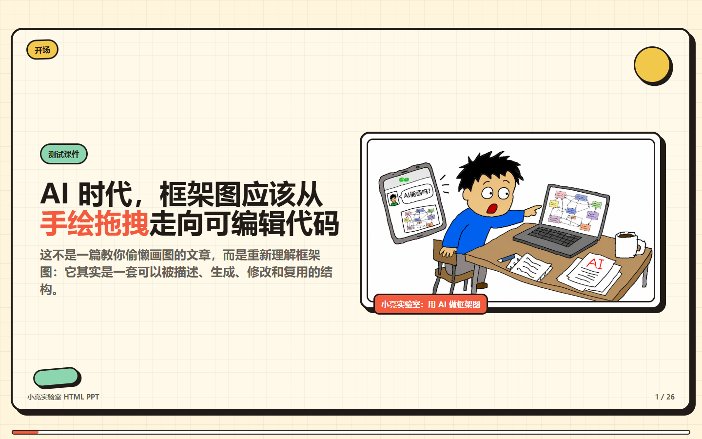
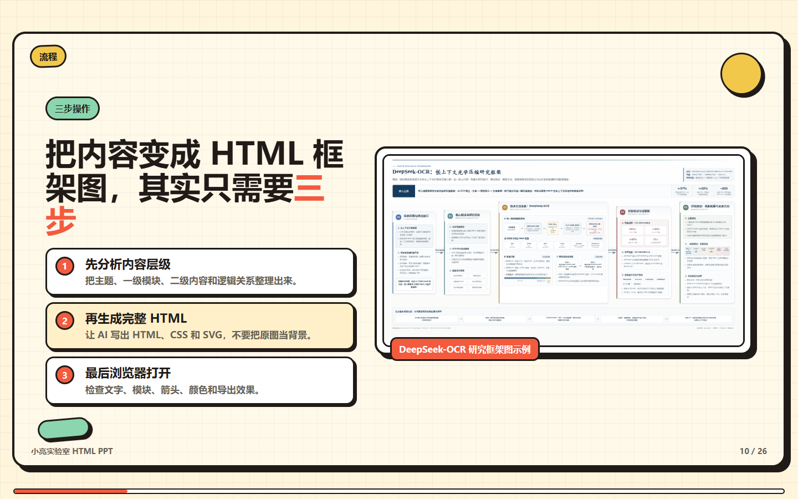
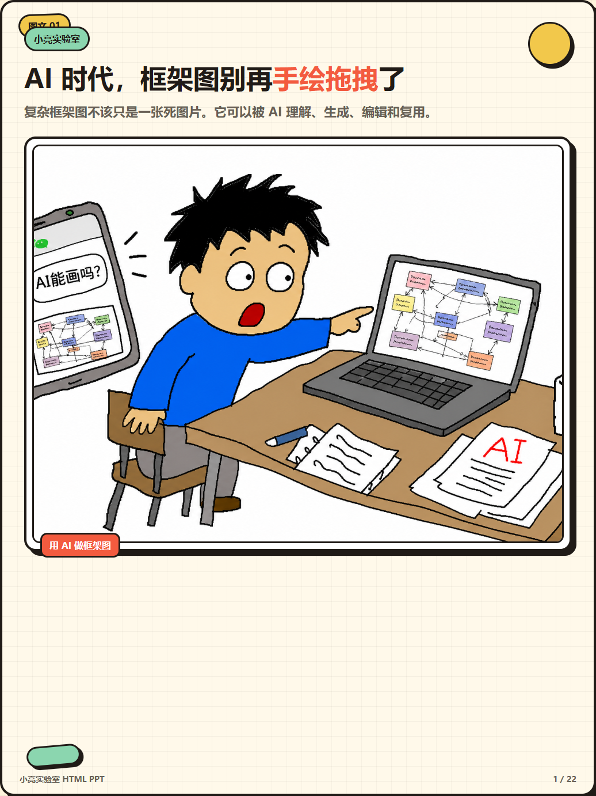
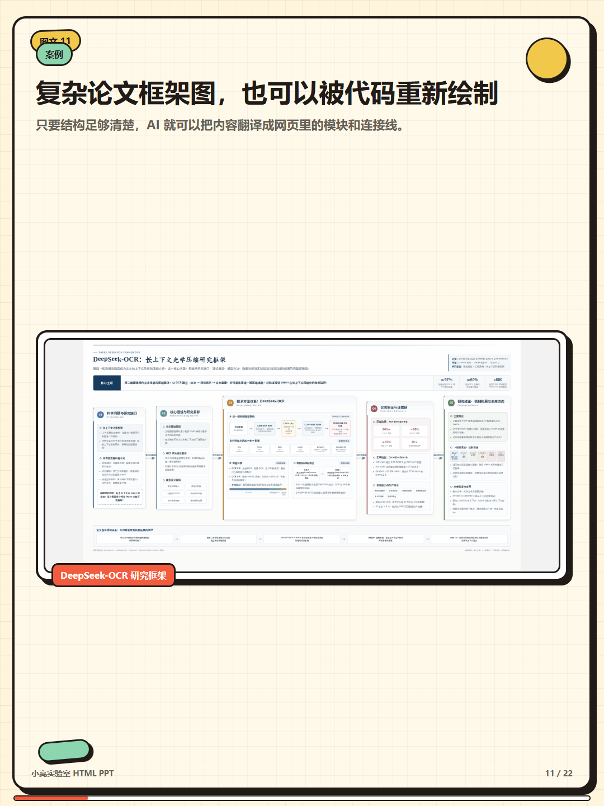

# 小亮实验室 HTML PPT Skill

由博主 **科技小亮AGI** 制作的 Codex Skill，用来把中文长文、教程、公众号文章、讲稿和图片素材目录，生成小亮实验室风格的 HTML PPT。

它不是普通摘要模板，而是一套“读文章、看图片、拆教学路径、生成可翻页 HTML”的内容生产工作流。适合把一篇文章变成可录屏讲解的 16:9 横版课件，也可以变成适合图文发布的 3:4 竖版卡片。

> 公开版只保留一种视觉风格：**小亮实验室**。不做多风格选择，重点把一个中文创作者风格打磨稳定。

## 效果预览

### 16:9 横版 HTML PPT

适合录屏讲解、课程演示、工具 walkthrough、公众号长文改课件。





### 3:4 竖版图文卡片

适合小红书图文、公众号配图、朋友圈图文、知识卡片和逐页发布。





## 它解决什么问题

很多文章不是缺 PPT，而是缺一个能把内容讲顺的中间层：

- 长文太长，直接做 PPT 容易变成摘要。
- 图片很多，截图不知道应该放在哪一页。
- 16:9 课件和 3:4 图文的组织方式完全不同。
- AI 生成的 HTML 好看不够，还要能翻页、能放大截图、能验证图片加载。

这个 Skill 的目标是让 Codex 按“教学型内容”来处理文章：先理解内容和图片，再设计页面结构，最后生成可验证的单文件 HTML。

## 核心能力

- **16:9 横版课件**：适合录屏、课程、演示、横屏分享。
- **3:4 竖版卡片**：适合小红书、公众号配图和图文发布。
- **图片素材盘点**：先阅读图片目录，再把截图放到对应讲解位置。
- **小亮实验室单风格**：暖纸背景、手绘粗线框、贴纸标签、错位黑色投影。
- **可交互 HTML**：键盘翻页、滚轮翻页、概览模式、全屏、hash 深链、图片悬停放大。
- **真实验证脚本**：静态检查页数和图片路径，条件允许时用 Chrome/Edge 做真实渲染检查。

## 两种输出模式

### `deck`：16:9 横版课件

默认模式。适合：

- AI 工具讲解。
- GitHub / 编程 / 工作流教程。
- 产品功能 walkthrough。
- 公众号长文改成录屏 PPT。
- 有大量真实界面截图的教学内容。

推荐页数：详细教程通常 30-50 页。每页只讲一个概念、一个界面区域、一个操作步骤或一个总结。

常用布局：

- `image`：左文右图。
- `imageWide`：左侧说明 + 右侧大截图。
- `duo`：文字 + 两张上下堆叠图片。
- `imageStep`：纵向步骤条 + 截图。
- `text`：标题 + 信息卡片或清单。
- `steps`：纯步骤页。

### `cards`：3:4 竖版图文

当用户提到 3:4、竖版、卡片、图文、小红书、公众号配图、社交发布时使用。

`cards` 不是把 16:9 PPT 裁剪成竖版，而是重新改写成每张都能独立阅读的图文卡片。

推荐页数：8-20 张。每张卡只保留一个清晰观点或一个可扫读步骤。

常用布局：

- `coverVertical`：竖版封面卡。
- `quoteCard`：观点/金句卡。
- `stackedImage`：文字和图片上下堆叠。
- `verticalSteps`：竖向步骤卡。

## 推荐使用方式

### 从文章和图片目录生成 16:9 PPT

```text
使用 xiaoliang-html-ppt-skill，把这篇文章和图片目录做成 16:9 可翻页 HTML PPT。
用于录屏讲解，内容要详细，不要做成摘要。
请先读取图片目录，理解每张图片的用途，再放到合适的讲解位置。
风格使用小亮实验室。
```

### 从文章生成 3:4 图文卡片

```text
使用 xiaoliang-html-ppt-skill，把这篇文章做成 3:4 竖版图文卡片。
适合小红书/公众号发布，每页都要能独立读懂。
不要裁剪横版 PPT，请重新组织成图文阅读路径。
风格使用小亮实验室。
```

## 生成结果应该包含

- `index.html` 或用户指定名称的 HTML 文件。
- 16:9 横版或 3:4 竖版幻灯片舞台。
- 左右键、空格、PageUp/PageDown 翻页。
- 鼠标滚轮翻页。
- `O` 键打开概览。
- `F` 键全屏。
- `Esc` 关闭概览和图片放大。
- 图片悬停放大。
- 本地相对图片路径。

## 设计原则

小亮实验室风格不是商务模板，也不是蓝紫渐变 AI 海报。它应该像创作者的实验笔记：

- 暖纸背景。
- 轻微网格纹理。
- 深色手绘线框。
- 错位黑色投影。
- 贴纸标签和胶囊标签。
- 番茄红、芥末黄、薄荷绿等暖色点缀。
- 中文判断句标题，像创作者在给观众讲明白一件事。

不建议用于：

- 纯商务汇报。
- 极简学术论文展示。
- 不需要讲解的静态海报。
- 只追求酷炫动效、没有教学路径的页面。

## 工作流

使用这个 Skill 时，Codex 应按下面顺序工作：

1. 完整阅读文章或来源文件。
2. 盘点图片目录，必要时生成 contact sheet。
3. 判断输出模式：`deck` 或 `cards`。
4. 规划教学路径，而不是做文章摘要。
5. 只使用小亮实验室风格。
6. 基于 `assets/template.html` 生成单文件 HTML。
7. 运行静态验证和浏览器验证。
8. 交付 HTML 文件、页数、图片覆盖情况和验证结果。

## 验证工具

修改 Skill 后建议先运行：

```powershell
$env:PYTHONUTF8='1'
py C:\Users\kangt\.codex\skills\.system\skill-creator\scripts\quick_validate.py <skill目录>
node scripts\validate-template.mjs
```

生成具体 HTML 后，先做静态验证：

```powershell
node scripts\validate-generated-html.mjs <生成的HTML路径> --mode deck --min-slides 20
node scripts\validate-generated-html.mjs <生成的HTML路径> --mode cards --min-slides 8
```

如果本机有 Playwright 包和 Chrome/Edge，可以继续做真实浏览器检查：

```powershell
node scripts\browser-check-generated.mjs <生成的HTML路径> --mode deck --expected-slides 26
node scripts\browser-check-generated.mjs <生成的HTML路径> --mode cards --expected-slides 22
```

真实生成遇到的问题和处理方式记录在 `references/testing-lessons.md`。后续修改 Skill 时，应先读这份文件。

## 仓库结构

```text
xiaoliang-html-ppt-skill/
├── SKILL.md
├── README.md
├── agents/
│   └── openai.yaml
├── assets/
│   └── template.html
├── docs/
│   ├── assets/readme/
│   └── superpowers/plans/
├── references/
│   ├── authoring-workflow.md
│   ├── design-system.md
│   ├── interactions.md
│   ├── style-presets.md
│   └── testing-lessons.md
└── scripts/
    ├── browser-check-generated.mjs
    ├── validate-generated-html.mjs
    └── validate-template.mjs
```

## 关于作者

这个 Skill 由博主 **科技小亮AGI** 制作，用于探索 AI 时代的中文内容生产、HTML PPT、图文卡片和可验证的创作者工作流。

如果你也经常把文章、教程、工具经验、AI 工作流整理成可讲解内容，这个 Skill 的目标就是帮你少做重复排版，多把精力放在内容判断和表达质量上。
